# 概述   

* 教程 [anchor](http://wiki.jikexueyuan.com/project/intellij-idea-tutorial/ "anchor")  

* 官网 [anchor](https://www.jetbrains.com "anchor")  

* 所有IDE中最具沉浸式的IDE，没有之一。   

## VPN网络加速   

* 访问官网   

* 访问插件库   

* 小版本更新   

## 破解   

* http://www.iteblog.com/idea/key.php   

* 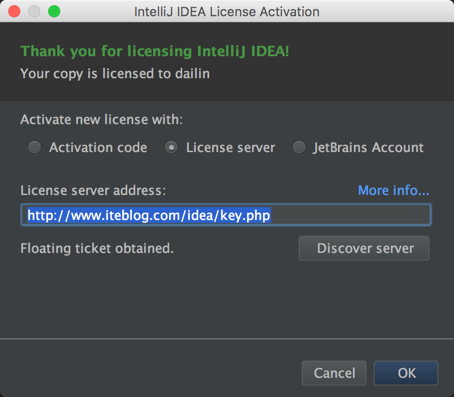   

* 放下Eclipse的开发思维   

## 版本   

### 旗舰版   

* Ultimate   

### 社区版   

* Community   

## 主题   

* Darcula   

* 版本更新不会引起项目或软件配置问题   

* http://www.ituring.com.cn/article/37792 [anchor](http://www.ituring.com.cn/article/37792 "anchor")  

# 安装   

## 版本更新   

* 小版本更新建议卸载旧版本   

* 大版本更新建议保留旧版本   

* 支持一台电脑安装多个版本的IntelliJ IDEA   

* Windows [anchor](http://wiki.jikexueyuan.com/project/intellij-idea-tutorial/windows-install.html "anchor")  

## Ubuntu [anchor](http://wiki.jikexueyuan.com/project/intellij-idea-tutorial/ubuntu-install.html "anchor")  

* Linux卸载只需要删除对应的目录   

## Mac OS X [anchor](http://wiki.jikexueyuan.com/project/intellij-idea-tutorial/mac-install.html "anchor")  

### 使用高版本的JDK运行IntelliJ IDEA   

* 1、找到 IntelliJ IDEA.app 然后对此进行 右键 > 显示包内容 > Contents > Info.plist   

* 2、修改 JVMVersion 的属性值，如果是 JDK 8，则改为 1.8*。   

#### 概要   

* 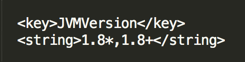   

## 开发Java Web项目   

* 2G内存基本不够用   

* 推荐内存8G+固态硬盘   

# 快捷键 [anchor](http://wiki.jikexueyuan.com/project/intellij-idea-tutorial/keymap-mac-introduce.html "anchor")  

## 模板   

*    

## 编辑   

* 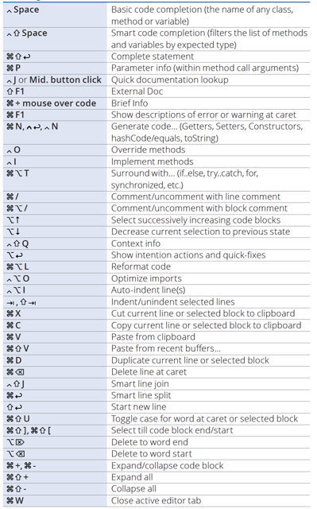   

## 查找和替换   

* 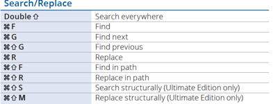   

## 搜索   

* 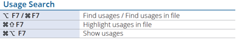   

## 编译和运行   

* 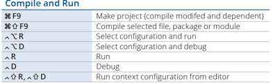   

## 调试   

* 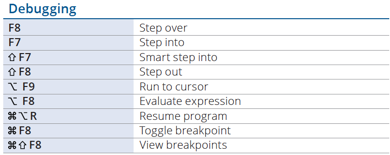   

## 导航   

* 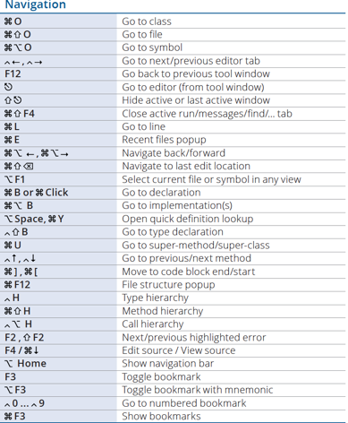   

## 重构   

* 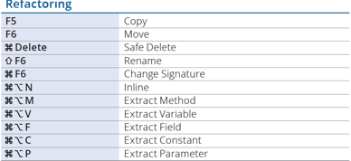   

## 版本管理   

*    

## 通用   

* 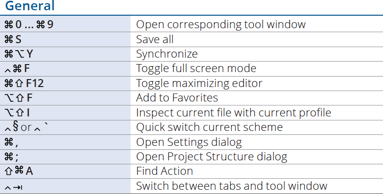   

## 常用快捷键   

### 格式化代码   

#### Opt+Cmd+L   

* 与显示Launchpad冲突   

* 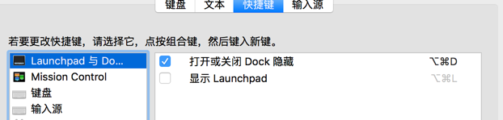   

### 删除当前行   

* Cmd+Delete   

* Cmd+X   

### 复制当前行到下一行   

* Cmd+D   

### 移动当前行到上一行   

* Shift+Opt+上   

### 移动当前行到下一行   

* Shift+Opt+下   

### 导入类   

#### 优化导入   

* Ctl+Opt+O   

#### 导入单个类   

* Opt+Enter   

### 自动抽取变量   

* Opt+Cmd+V   

### foreach   

* vars.for   

### 编辑   

#### 当前文件   

##### 查找   

* Cmd+F   

###### 下一个   

* Cmd+G   

###### 上一个   

* Cmd+Shift+G   

##### 替换   

* Cmd+R   

#### 全局文件   

##### 查找   

* Cmd+Shift+F   

##### 替换   

* Cmd+Shift+R   

#### java？   

##### 显示类的层次结构   

###### Ctl+H   

* 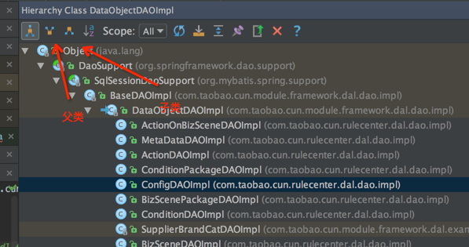   

* 接口？   

##### 显示方法的层次结构   

###### Cmd+Shift+H   

* 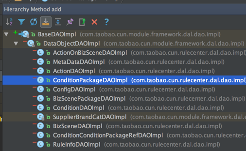   

##### 定位到声明处   

###### 定位到当前方法的声明处   

* Cmd+U   

###### 定位到要调用的方法的声明处   

* Cmd+鼠标单击   

* Cmd+B   

##### 定位到要调用的方法的实现处   

* Opt+Cmd+鼠标单击   

* Opt+Cmd+B   

##### 查看变量方法被调用的地方   

* Cmd+鼠标单击   

* Opt+Cmd+F7   

###### 概要   

* 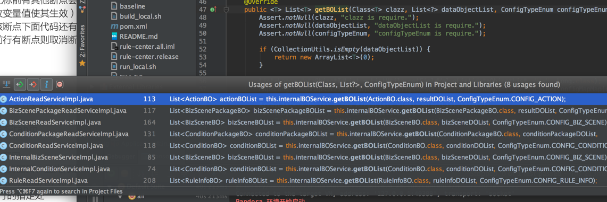   

##### 上一个方法   

* Ctl+上   

##### 下一个方法   

* Ctl+下   

##### 查看当前类的方法   

###### Cmd+F12   

* 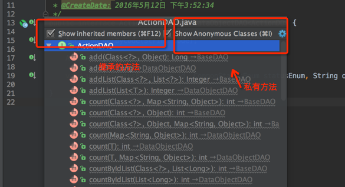   

* ⌃⌥H 显示调用层次结构   

##### 显示类方法说明   

###### Ctrl + Q   

* 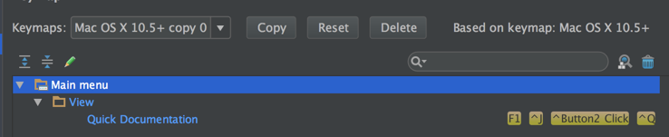   

* 复制全限定名？   

#### 文件头   

* Fn+上上   

#### 文件尾部   

* Fn+下下   

#### 行首   

* Fn+左左   

#### 行尾   

* Fn+右右   

#### 行尾自动加分号   

* Shift+Cmd+Enter   

#### 显示要调用方法的参数信息   

* Ctl+Shit+Space   

* ⌘F1 在错误或警告处显示具体描述信息   

#### 生成代码   

##### Cmd+N   

* 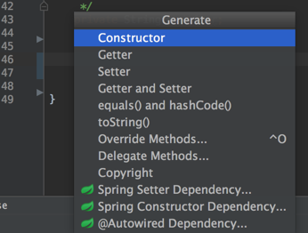   

#### 实现接口中的方法   

##### Ctl+I   

* 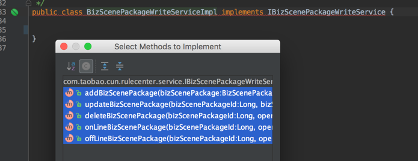   

* 可以拷贝方法的注释过来   

#### 包围代码   

##### Cmd+Opt+T   

* 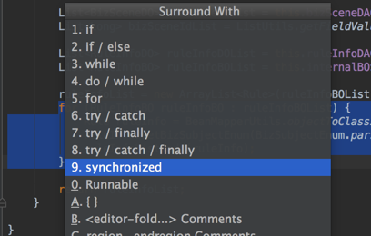   

#### 注释   

##### 单行注释   

* Cmd+/   

##### 多行注释   

* Opt+Cmd+/   

#### 连选代码   

* Shift+上下   

#### 开启新的一行   

* Shitf+Enter   

#### 大小写切换   

* Cmd+Shift+U   

#### 向前删除单词   

* Opt+Delete   

#### 向后删除单词   

* Opt+Fn+Delete   

#### 折叠/展开代码   

##### 折叠   

* Cmd+-   

* Cmd+Shift+-   

##### 展开   

* Cmd++   

* Cmd+Shift++   

#### 调出偏好设置   

* Cmd+,   

#### 块编辑(竖编辑模式)   

* Shift+Cmd+8   

* 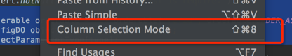   

#### 快速修复错误   

* Alt + Enter   

### 查询替换   

#### 查询任何东西   

* 双击Shift   

#### 查询结构   

* Cmd+Shift+S   

#### 替换结构   

* Cmd+Shift+M   

#### 概要   

* 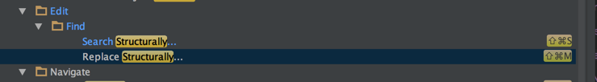   

### 使用查询   

#### 在文件中查找用法   

##### Opt+F7   

* 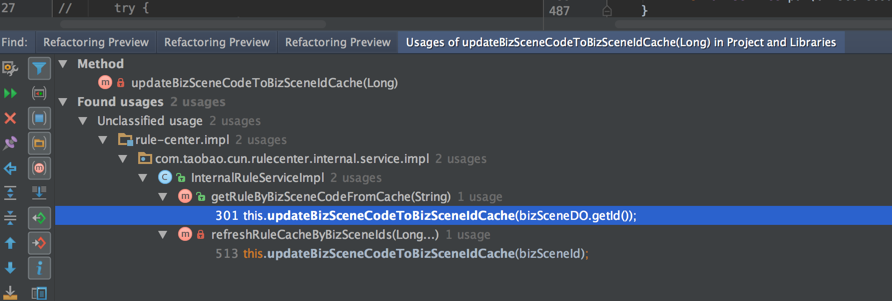   

#### 在类中查找用法   

* Cmd+F7   

* ⌘⇧F7 在文件中突出显示的用法   

* ⌘⌥F7 显示用法   

### 编译和运行   

* ⌘F9 编译Project   

* ⌘⇧F9 编译选择的文件、包或模块   

* ⌃⌥R 弹出 Run 的可选择菜单   

* ⌃⌥D 弹出 Debug 的可选择菜单   

* ⌃R 运行   

* ⌃D 调试   

* ⌃⇧R, ⌃⇧D 从编辑器运行上下文环境配置   

### 调试   

#### 进入方法体   

* F7   

##### Shift F7   

###### 智能进入，选择方法进入   

* 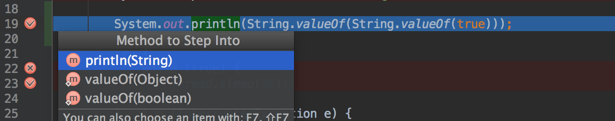   

#### 下一步   

* F8   

#### 退出方法体   

* Shift+F8   

* F9   

#### 计算表达式（可以更改变量值使其生效）   

* Opt+F8   

#### 运行到光标处，如果光标前有其他断点会进入到该断点   

* Opt+F9   

* ⌘⌥R 恢复程序运行，如果该断点下面代码还有断点则停在下一个断点上   

* ⌘F8 切换断点（若光标当前行有断点则取消断点，没有则加上断点）   

* ⌘⇧F8 查看断点信息   

#### 设置条件断点   

##### Cmd+Shift+F8   

###### 当前行是断点   

* 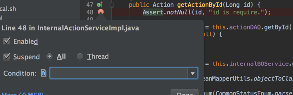   

###### 当前行不是断点   

* 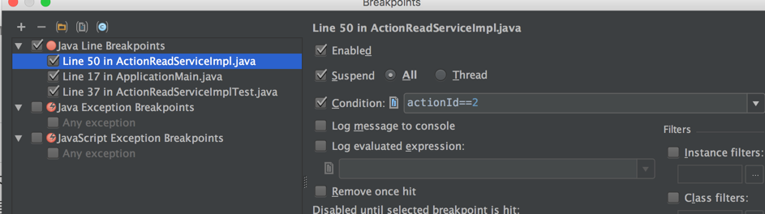   

#### 特殊技能   

##### 查看变量   

* 选中对象后，使用快捷键 Alt + F8。   

* 选中对象后，拖动对象到 Watches。   

* 选中对象后，鼠标悬停在对象上 2 秒左右   

##### 停掉后面所有断点   

* 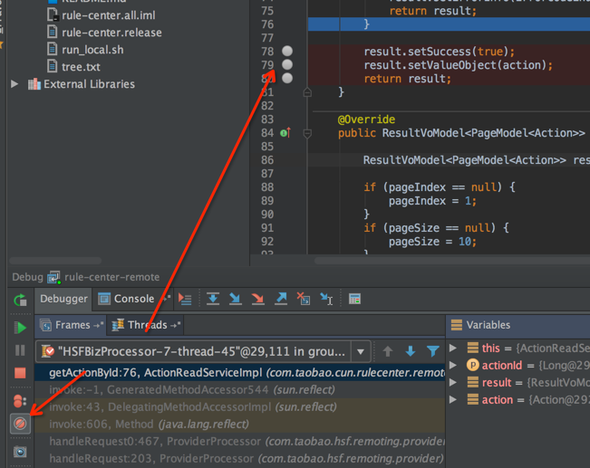   

##### 回到方法调用处，可以重新进入，用于多次调试   

* 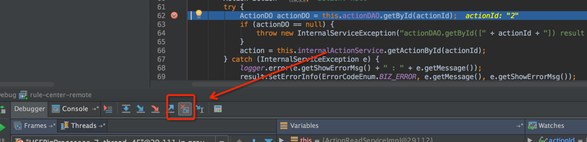   

* Drop Frame   

### 导航   

#### 查找类文件   

* Cmd+O   

#### 查找打开文件或目录   

* Cmd+Shift+O   

* 打开目录需要在输入的内容前面或后面加一个反斜杠/   

#### 前往指定的变量 / 方法   

* ⌘⌥O   

* ⌃← / ⌃→ 左右切换打开的编辑tab页   

* F12 返回到前一个工具窗口   

#### 退出工具窗口，焦点回到代码编辑窗口   

* Esc   

#### 定位到指定函行   

* Cmd+L   

* ⌘E 显示最近打开的文件记录列表   

#### 退回 / 前进到上一个操作的地方   

* ⌘⌥←    /    ⌘⌥→   

* ⌘[    /   ⌘]   

#### 选择当前文件的目标   

##### Opt+F1   

* 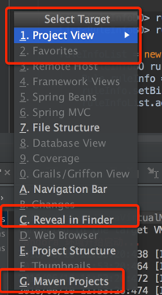   

* F3选中文件/文件夹/代码行，添加/取消书签   

* ⌥F3 选中文件/文件夹/代码行，使用助记符添加/取消书签   

* ⌃0...⌃9 定位到对应数值的书签位置   

* ⌘F3 显示所有书签   

### 重构   

#### 文件   

##### 复制文件到指定目录   

* F5   

##### 移动文件到指定目录   

* F6   

##### 重命名文件   

* Shift+F6   

#### 方法   

##### 更改签名   

* Cmd+F6   

#### 代码片段   

##### 选择的代码提取为方法   

* Opt+Cmd+M   

#### 提取变量   

* Opt+Cmd+V   

#### 提取字段   

* Opt+Cmd+F   

#### 提取常量   

* Opt+Cmd+C   

#### 提取参数   

* Opy+Cmd+P   

#### 一致性   

* Opt+Cmd+N   

#### 菜单   

* 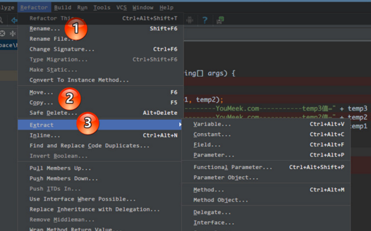   

#### 重构一切   

* Ctl+T   

### 版本控制   

* ⌘K 提交代码到版本控制器   

* ⌘T 从版本控制器更新代码   

* ⌥⇧C 查看最近的变更记录   

* ⌃C 快速弹出版本控制器操作面板   

### 动态代码模板   

* ⌘⌥J 弹出模板选择窗口，将选定的代码使用动态模板包住   

* ⌘J 插入自定义动态代码模板   

### 通用   

#### ⌘1...⌘9 打开相应编号的工具窗口   

##### ⌘1   

* Project   

* 最大最小化代码编辑区   

##### ⌘2   

* Favorites   

##### ⌘3   

* Find   

* ⌘4   

* ⌘S 保存所有   

#### 全屏   

* Ctl+Shift+F   

#### 最大化编辑器   

* ⌘⇧F12   

* ⌘, 打开IDEA系统设置   

* ⌘; 打开项目结构对话框   

* ⌘⌥Y 同步、刷新   

* ⌥⇧F 添加到收藏夹   

* ⌥⇧I 检查当前文件与当前的配置文件   

* §⌃, ⌃` 快速切换当前的scheme（切换主题、代码样式等）   

* ⇧⌘A 查找动作（可设置相关选项）   

* ⌃⇥ 编辑窗口标签和工具窗口之间切换（如果在切换的过程加按上delete，则是关闭对应选中的窗口）   

## 快捷键Top10   

* 自我修复：Alt+Enter   

### 智能补全：Ctrl+Shift+Space   

* 与输入法冲突，改为Ctl+,   

* 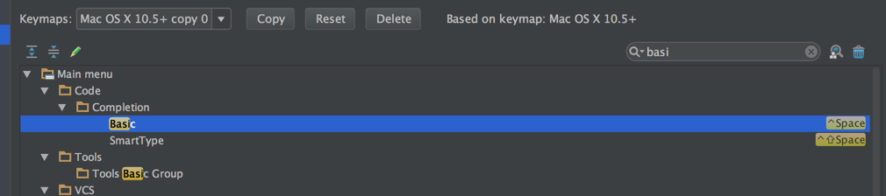   

* 重构一切：Ctrl+T   

### 创造万物：Alt+Insert   

* ？   

### 自动完成：Cmd+Shift+Enter   

* 自动补全右括号和分号等   

* 无处藏身：Shift+Shift   

### 发号施令：Ctrl+Shift+A   

* ？   

* 代码生成：Template/Postfix +Tab   

### 选你所想：Ctrl+W   

* ？   

* 切来切去：Ctrl+Tab   

* http://blog.csdn.net/xiaohulunb/article/details/20729261 [anchor](http://blog.csdn.net/xiaohulunb/article/details/20729261 "anchor")  

* http://blog.csdn.net/dc_726/article/details/42784275 [anchor](http://blog.csdn.net/dc_726/article/details/42784275 "anchor")  

## 概要   

* 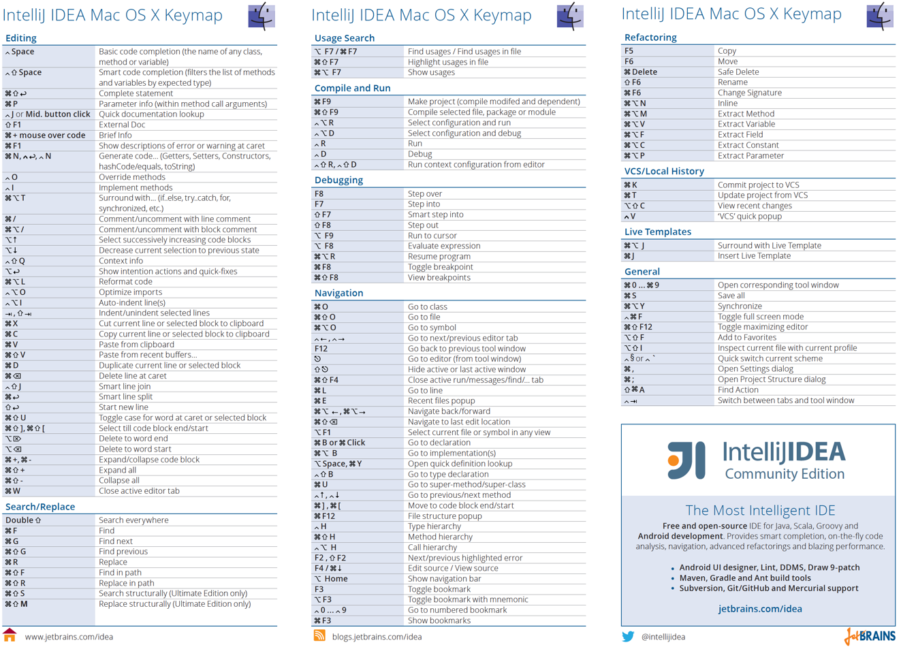   

* 首次运行   

# 安装目录   

## 个性化配置目录   

* config   

## JVM配置（bin/idea.vmoptions）   

### 默认配置   

* -Xms128m-Xmx750m-XX:MaxPermSize=350m-XX:ReservedCodeCacheSize=240m-XX:+UseCompressedOops   

### 16G推荐配置   

* -Xms512m-Xmx1500m-XX:MaxPermSize=500m-XX:ReservedCodeCacheSize=500m-XX:+UseCompressedOops   

## 属性配置（bin/idea.properties）   

*    

# 界面介绍   

* 最大单元Project   

* 创建索引过程中最好不要动项目   

## 显示Toolbar和Tool Buttons   

* view-->   

## 基本设置   

### 主题   

*    

### 字体   

#### 菜单字体   

* 需要选择包含中文的字体   

* Courier New，Monaco是单纯的英文字体   

#### 代码字体   

* 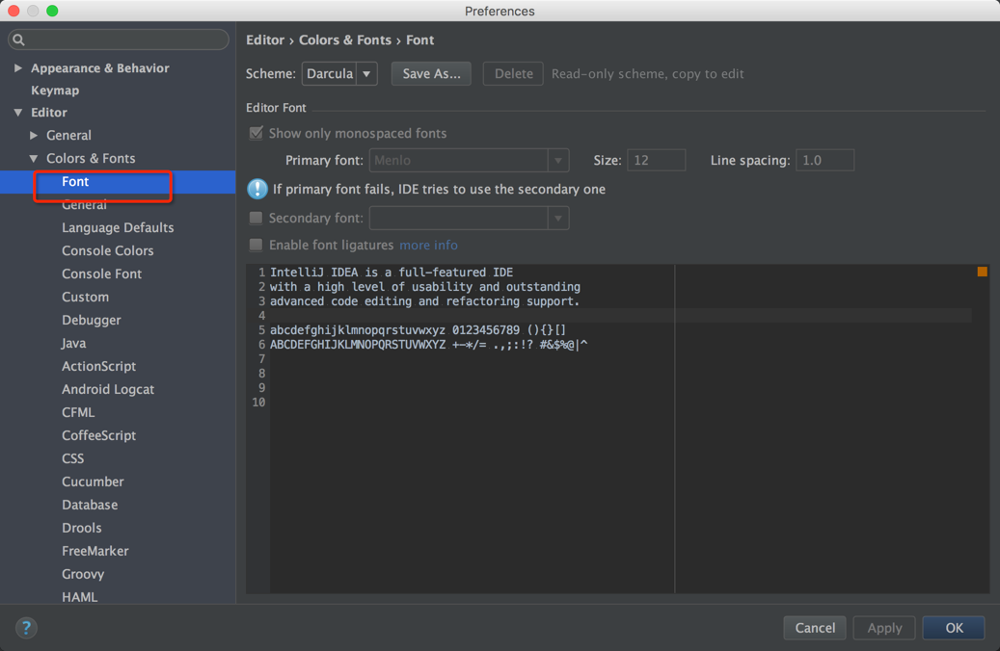   

#### 控制台字体   

* 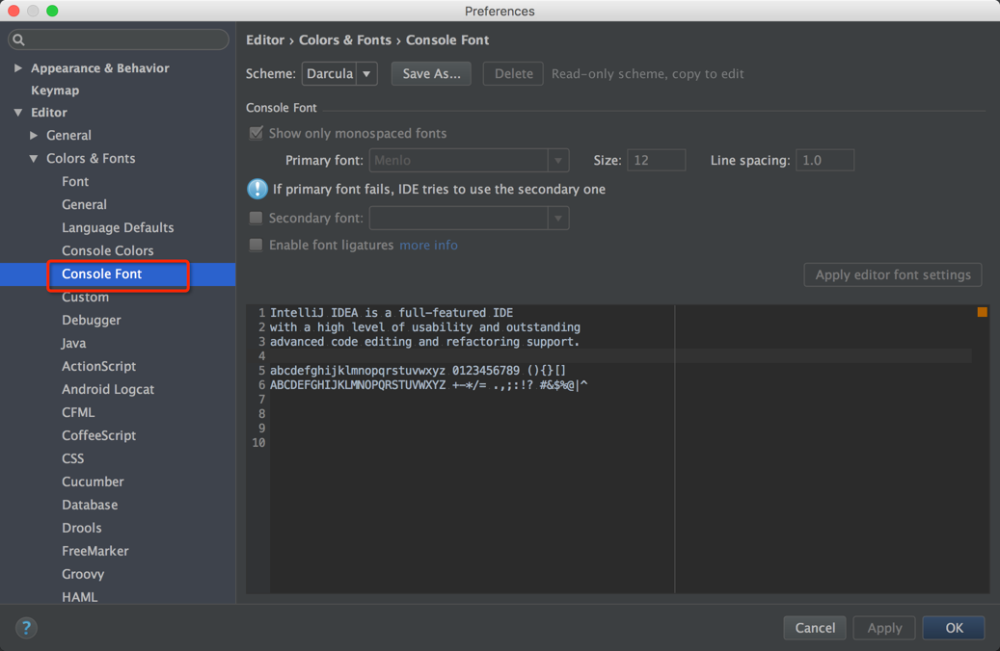   

### 定制菜单   

*    

### 编辑区主题   

* 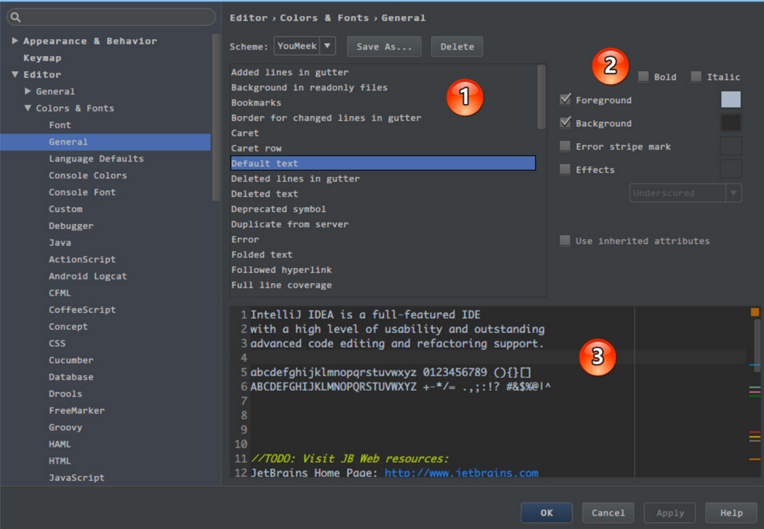   

### 文件编码修改   

* 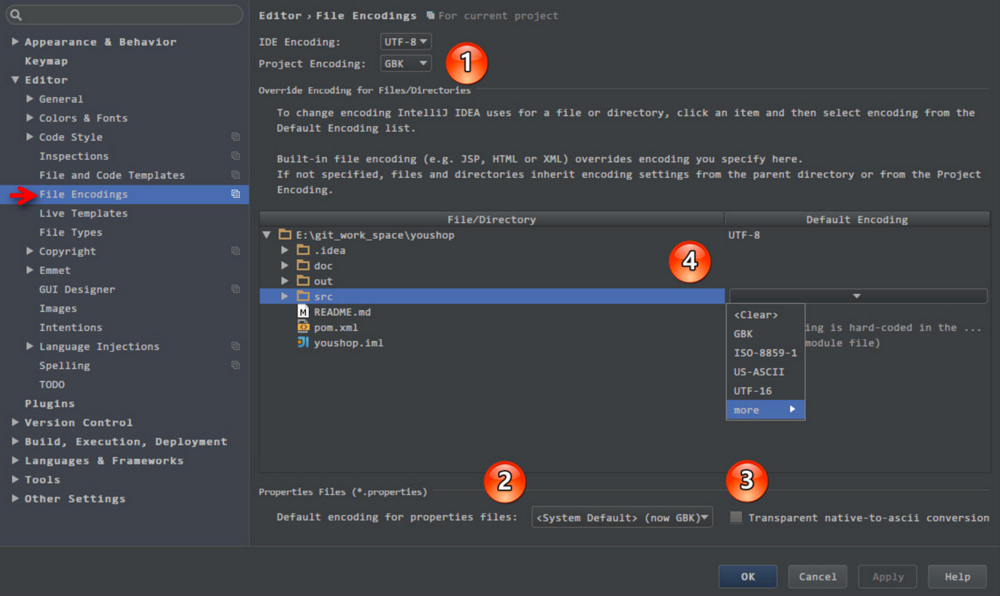   

## 编码问题   

*    

## 文件类型图标   

### java   

*    

* 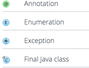   

* 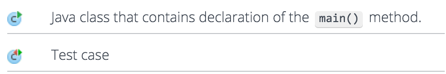   

#### Source root   

* 标记该目录下的文件是可编译的   

* 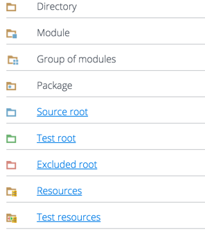   

* 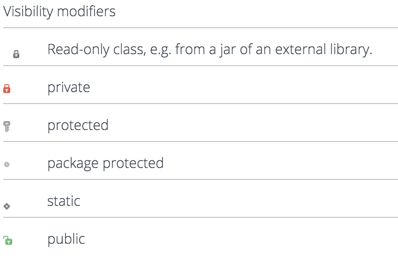   

### js   

* 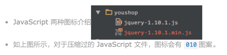   

# 缓存和索引   

## 索引   

* 加快查找、代码提示   

## 清除缓存和索引   

### File-->Invalidate Caches/Restart   

* 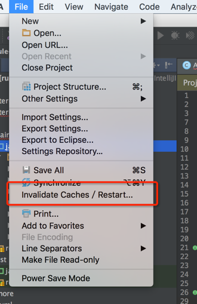   

* 本质是删除system目录下对应的文件，也可以去手动删除   

* 5M的项目，索引文件上百M   

# 编译   

## Eclipse   

* 手工编译   

* 实时编译   

## IntelliJ IDEA   

### 编译方式   

#### complie   

* 对选定的文件进行编译   

#### rebuild   

* 对选定的项目进行编译   

#### make   

##### 对选定的项目或模块进行编译   

* 修改过的文件才会进行编译   

* 没修过也会进行编译   

#### 概要   

* 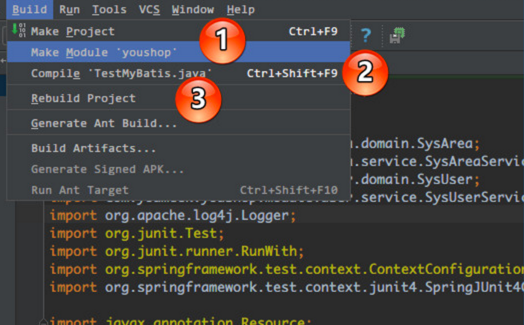   

### 编译时机   

#### 手工编译   

* make/rebuild   

#### 实时编译   

##### 占资源   

* 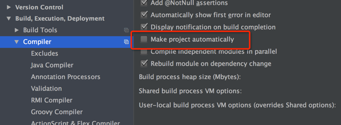   

#### 容器运行之前编译（默认）   

##### 在容器运行前配置一个编译事件   

* 默认在运行 JUnit 之前会先进行 Make 操作;   

###### 默认在运行 TestNG 之前会先进行 Make 操作;   

* 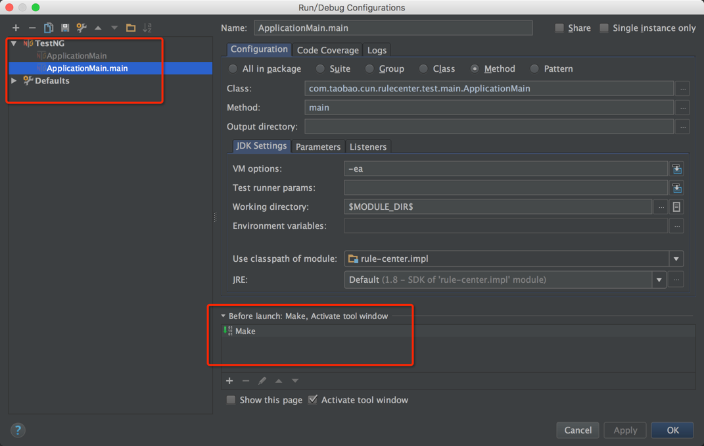   

* 默认在运行 tomcat 之前会先进行 Make 操作;   

* 不编译对代码语法检查没有影响   

* 但是对多个类之间的关联关系需要编译后才会做检查   

## 编译配置   

* 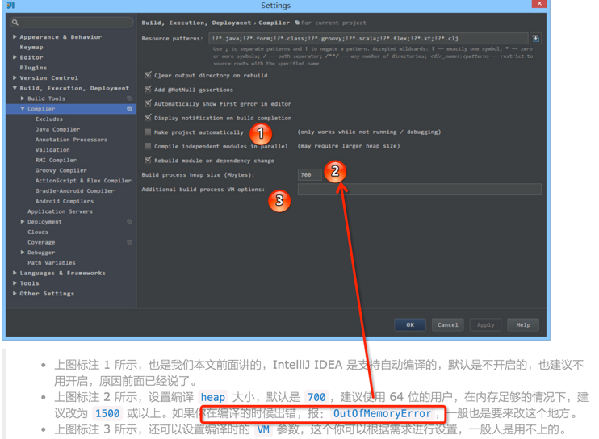   

### 排除编译列表   

* 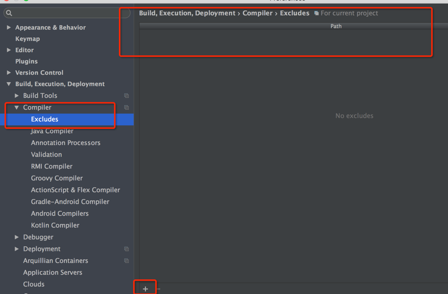   

### 项目或模块编译配置   

* 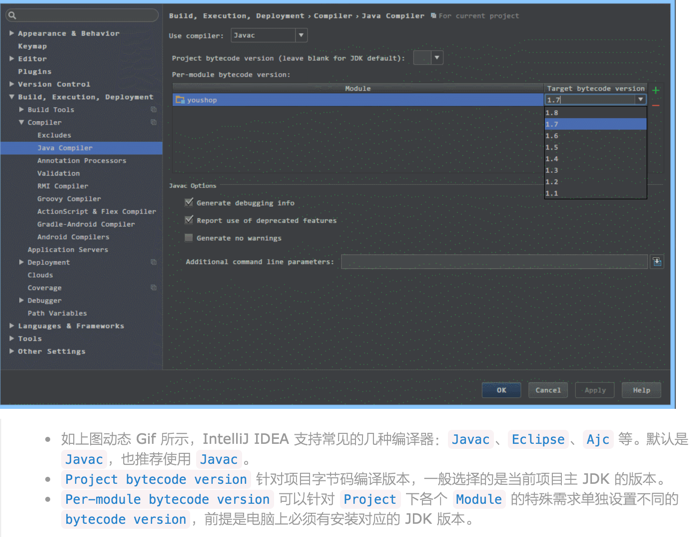   

# 项目   

* Project   

## Module   

* 可以给单独的Module设置编码格式和编译方式   

## 新建Project   

* 默认是单Module   

* 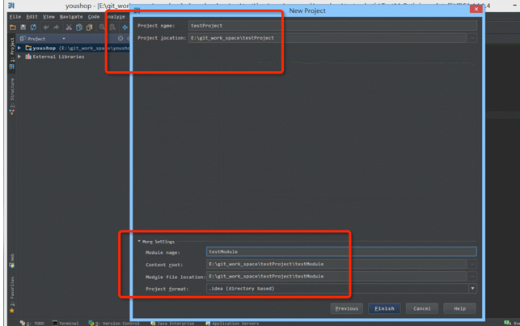   

## 项目结构设置   

* Cmd+;   

* SDK   

### Project Language level   

* 限定项目编译检查时最低要求的 JDK 特性   

#### 使用jdk8，但是只用1.7的特性   

* 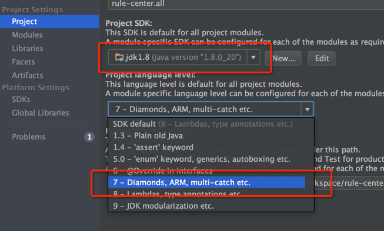   

### 可以对Project中的Module单独设置SDK和Language Level，默认为Project的SDK和Level   

* 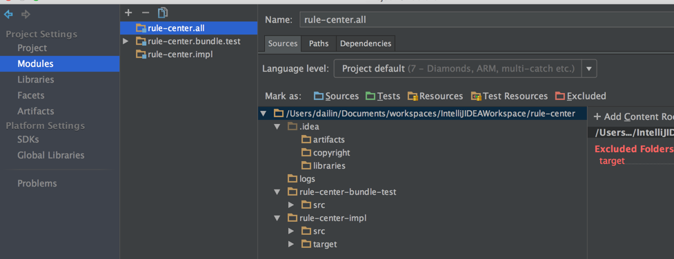   

## 新建项目   

### 展开包   

* 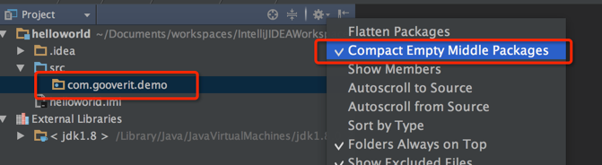   

### psvm   

* public static void main   

### sout   

* System.out.println();   

### serr   

* System.err.println("");   

### 配置文件   

#### .idea   

* 项目配置目录   

#### .iml   

* 模块配置文件   

* 一般不需要提及到版本仓库   

* 无需手动保存（Cmd+S），IntelliJ IDEA 自动保存   

### 格式化代码   

* Cmd+Alt+L   

* EclipseJavaWeb项目 [anchor](http://wiki.jikexueyuan.com/project/intellij-idea-tutorial/eclipse-java-web-project-introduce.html "anchor")  

## Maven [anchor](http://wiki.jikexueyuan.com/project/intellij-idea-tutorial/maven-project-introduce.html "anchor")  

### 菜单   

* 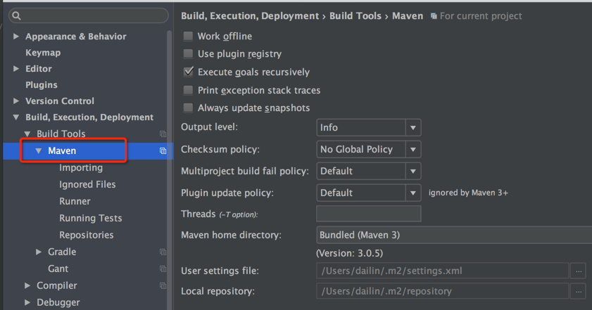   

#### 勾选Always update snapshots   

* 每次更新snapshots包   

* 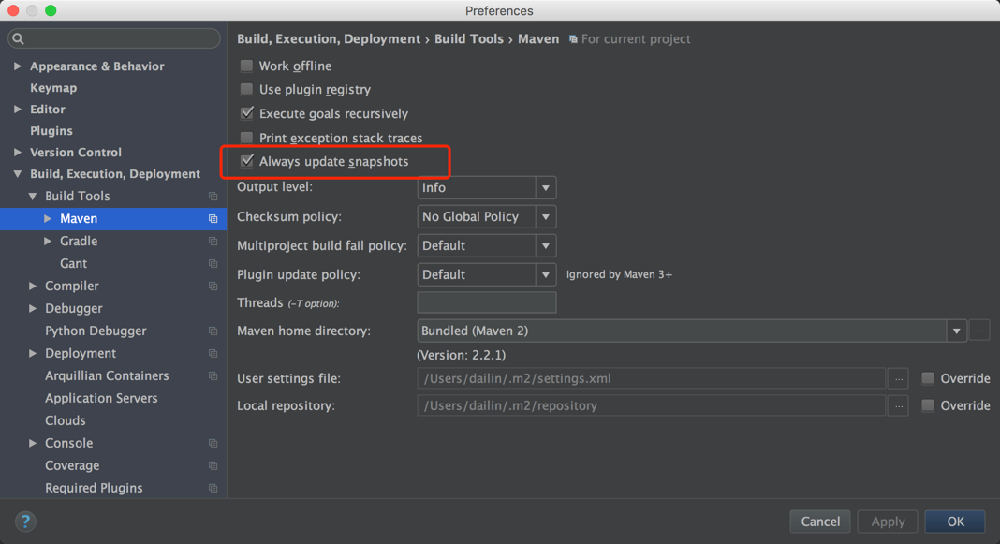   

#### 自动下载源码和文档   

* 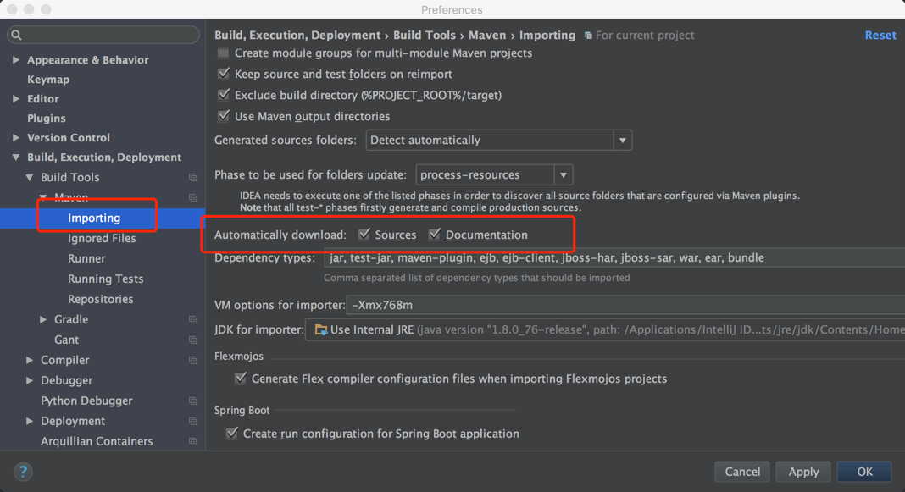   

* 排包？   

* 单模块的 Spring MVC + Spring + Mybatis [anchor](http://wiki.jikexueyuan.com/project/intellij-idea-tutorial/maven-java-web-project-introduce.html "anchor")  

* 多模块的 Spring MVC + Spring + Mybatis 讲解 [anchor](http://wiki.jikexueyuan.com/project/intellij-idea-tutorial/maven-java-web-project-introduce.html "anchor")  

### 新建模块   

* 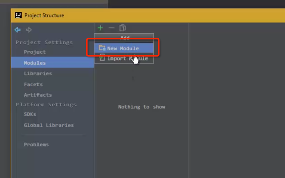   

### 导入了Maven项目后的设置   

* 1、导入模板   

#### 3、设置maven版本和仓库   

* 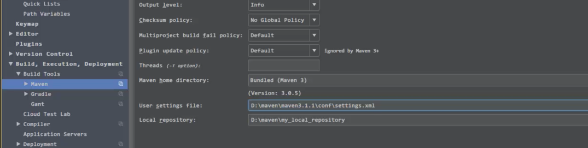   

#### 2、设置项目编码   

* 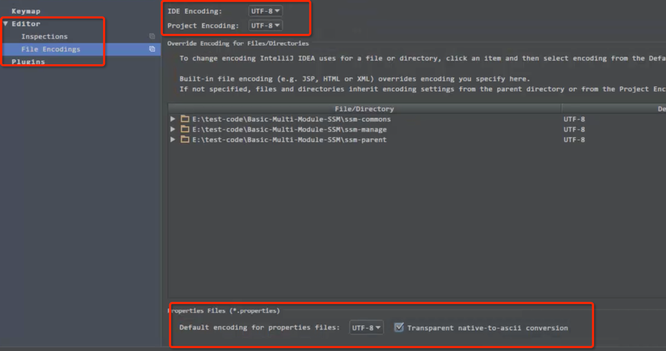   

#### 3、设置SDK（JDK）   

##### 设置Project   

* 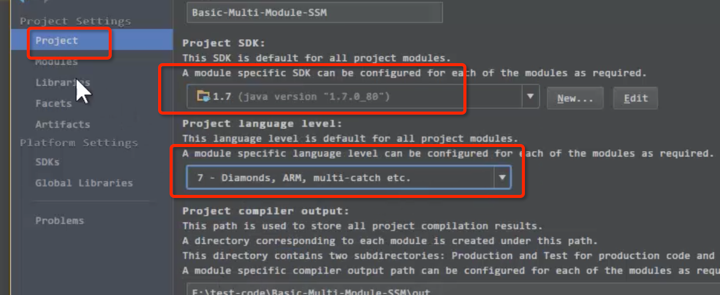   

##### 设置Module   

* 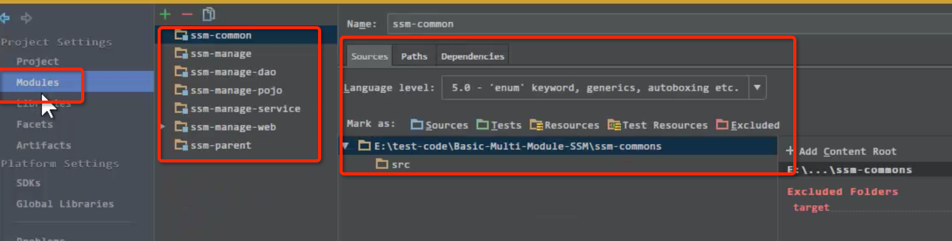   

#### 4、设置Spring相关   

* 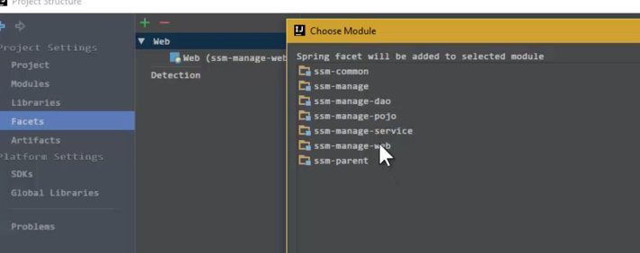   

#### 5、设置Java目录为Source目录   

* 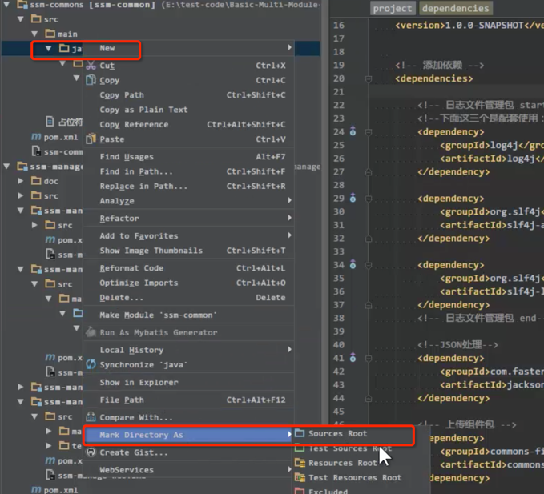   

### 一般多模块maven项目结构   

* 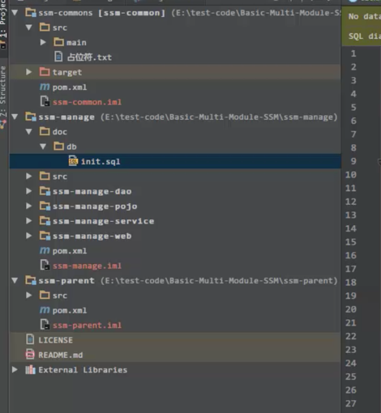   

* 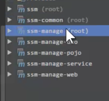   

# 版本管理   

* http://wiki.jikexueyuan.com/project/intellij-idea-tutorial/vcs-introduce.html [anchor](http://wiki.jikexueyuan.com/project/intellij-idea-tutorial/vcs-introduce.html "anchor")  

* 自带对GIT或者SVN版本控制工具的支持插件   

* 支持github [anchor](http://wiki.jikexueyuan.com/project/intellij-idea-tutorial/vcs-introduce.html "anchor")  

* 有些时候，我们做得是同一个任务，但是需要提交多次，为了更好管理项目，建议是提交的 Message 是保持一致的   

# 模板   

## 实时代码模板（Live Templates） [anchor](http://wiki.jikexueyuan.com/project/intellij-idea-tutorial/live-templates-introduce.html "anchor")  

### 支持获取当前   

* 类名   

* 方法名   

* 支持变量参数   

* 固定模式的代码   

* 本质是用XML文件来保存配置信息   

### 快捷键   

* Tab   

* Cmd+J   

* 环绕模板   

### 菜单   

* 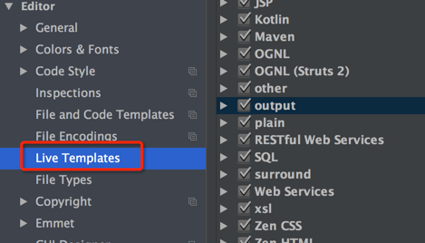   

## 文件和代码模板（File and Code Templates） [anchor](http://wiki.jikexueyuan.com/project/intellij-idea-tutorial/file-templates-introduce.html "anchor")  

### 菜单   

* 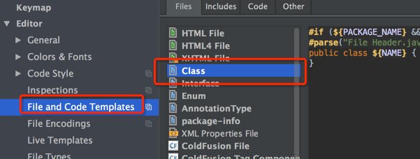   

## Emmet [anchor](http://wiki.jikexueyuan.com/project/intellij-idea-tutorial/emmet-introduce.html "anchor")  

* Zen Coding   

### 菜单   

*    

## Postfix Completion   

### 菜单   

* 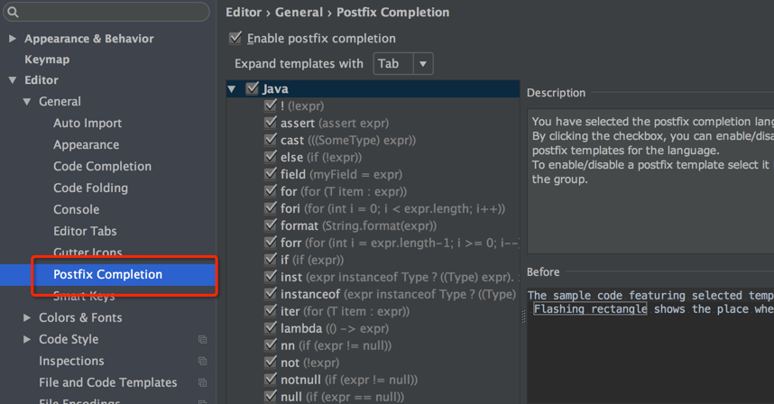   

# 插件 [anchor](http://wiki.jikexueyuan.com/project/intellij-idea-tutorial/plugins-settings.html "anchor")  

## 插件推荐   

* 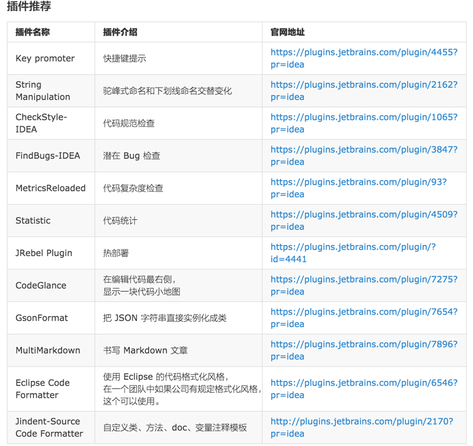   

* Java 热部署插件 JRebel [anchor](http://wiki.jikexueyuan.com/project/intellij-idea-tutorial/jrebel-setup.html "anchor")  

# 调试   

## 远程调试 [anchor](http://wiki.jikexueyuan.com/project/intellij-idea-tutorial/remote-debugging.html "anchor")  

* 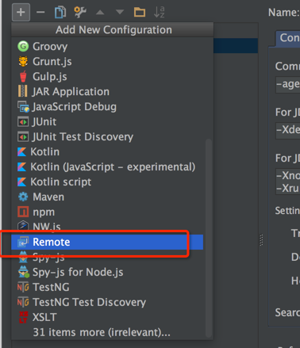   

## 条件断点   

* 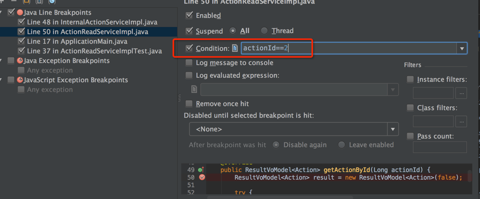   

## 调试技巧   

### Debug连接方式   

* 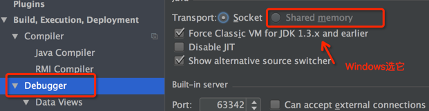   

* Shared memory 是 Windows 特有的一个属性，一般在 Windows 系统下建议使用此设置，相对于 Socket 会快点   

# 常用设置   

## 代码补全   

### 默认是区分大小写   

* 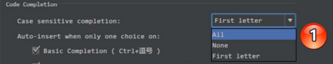   

### 设置为不区分大小写   

* None   

## 代码审查   

### inspection   

* 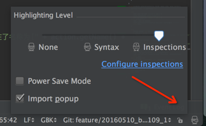   

* None 不设置检查。   

* Syntax 可以检查单词拼写，简单语法错误。   

* Inspections 为最高等级检查，可以检查单词拼写，语法错误，变量使用，方法之间调用等。   

## 导类设置   

* 自动导类   

* 自动优化导入的类   

### *导入   

* Java 类中导入的某个包下类超过这里设置的指定个数，就会换成用 * 号来代替   

* 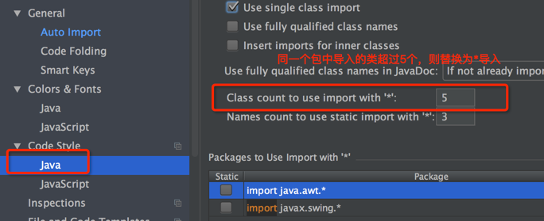   

### 概要   

* 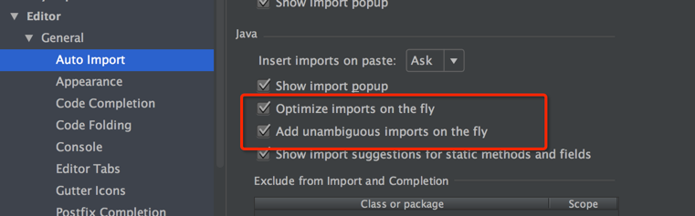   

## 省电模式(阅读模式)   

*    

* 会关闭代码检查和代码提示   

## 打开文件并定位到指定的行   

* Shift+Cmd+O   

* 输入文件名后，加上行号   

### 概要   

* 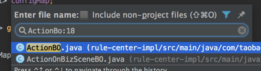   

## 代码折叠设置   

* 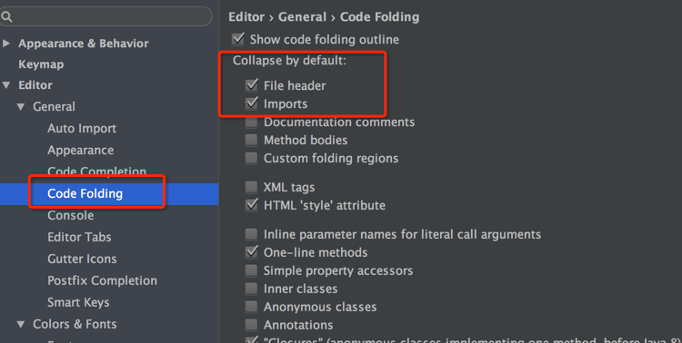   

## 代码分屏   

* 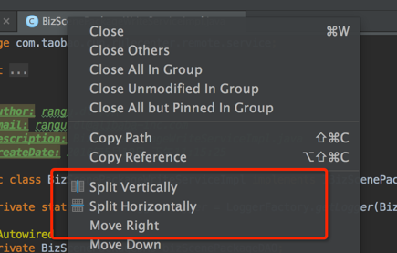   

## 开启单词拼写检查   

*    

## 重置窗口布局   

* 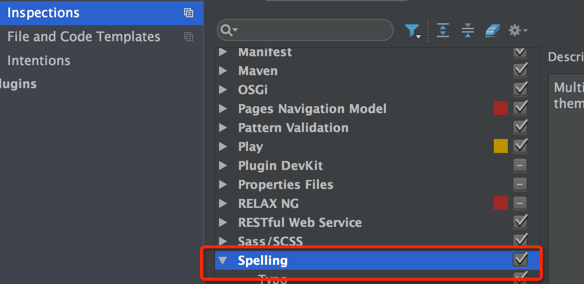   

## 代码提示   

### 默认为：Ctl+Space   

* 但是和输入法切换相冲突   

*    

* 修改为：Ctl+,   

## 显示内存占用情况   

* 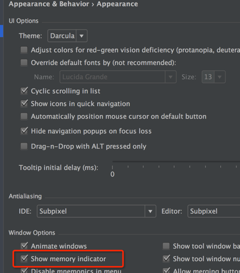   

## 设置多个文件Tab显示为多行   

* 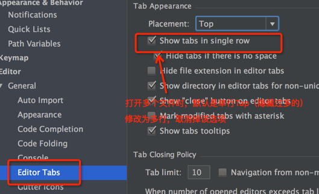   

## 设置为单行注释的斜杠跟随在代码的头部   

* 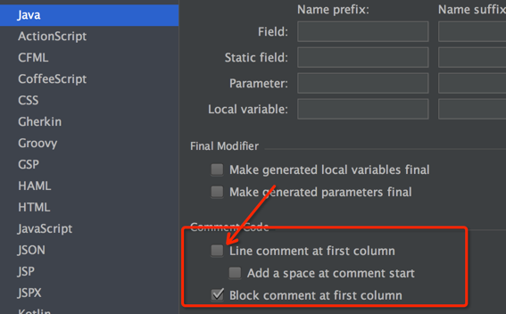   

* 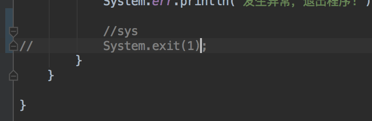   

## 打开IntelliJ默认打开上一次的项目   

*    

## 设置代码软分行   

* 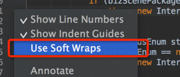   

*    

## 显示最打开的文件列表   

* Cmd+E   

* 默认为50个   

* 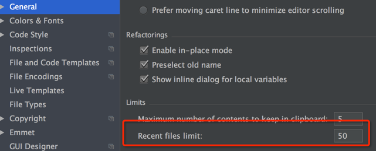   

## 设置打开文件的Tab数   

* 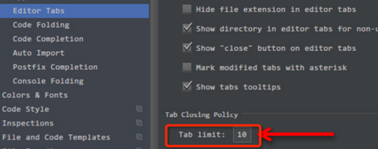   

* 当我们打开的文件超过该个数的时候，早打开的文件会被新打开的替换。   

## 设置文件打开方式   

* 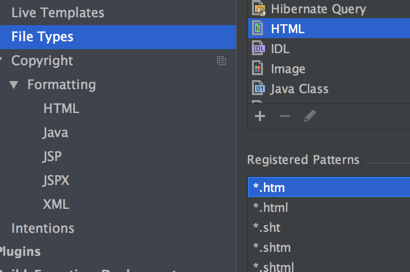   

## 窗口前置   

* 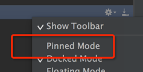   

## 添加收藏   

* 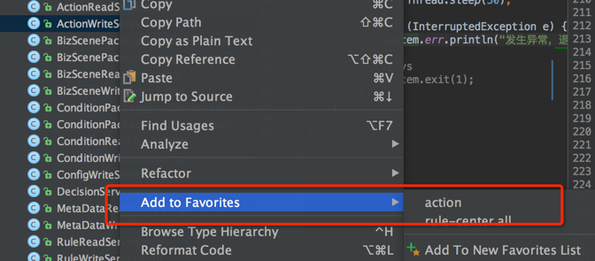   

* 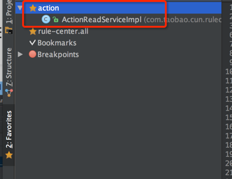   

## 定位文件所在位置   

* Opt+F1+1   

* 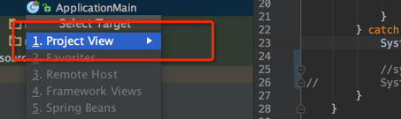   

## Cmd+滚轮放大缩小代码   

* 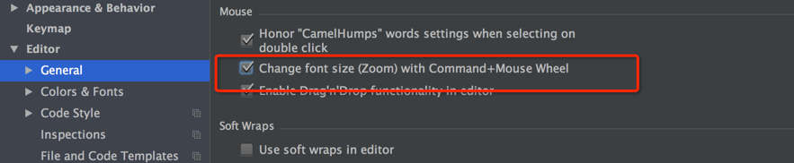   

## Cmd+滚轮放大缩小图片   

* 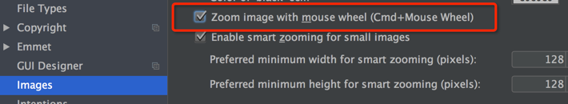   

* 显示行数   

* 显示方法线   

## 自动以折叠的代码区域   

### Opt+Cmd+T   

* 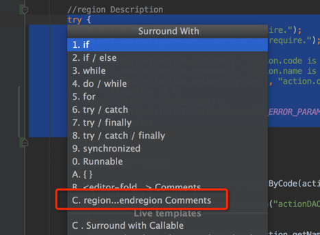   

## 本地历史记录   

### 右键-->Local History   

* 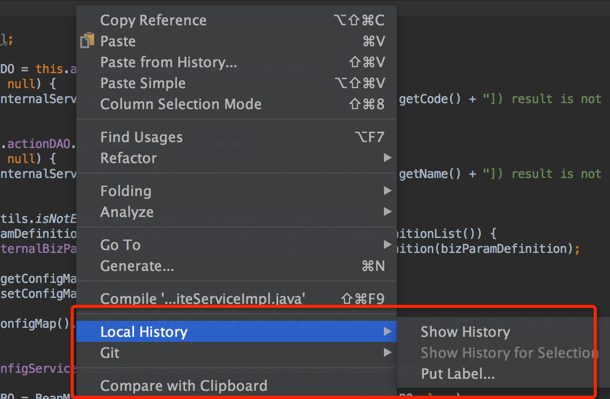   

* 文件的历史记录   

### 当前选中行的历史记录   

* 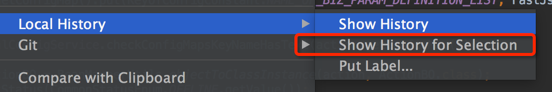   

### 文件夹的历史记录   

* 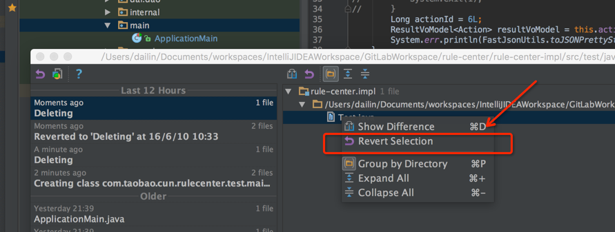   

* 可以恢复删除了的文件   

## 断点批量删除   

* 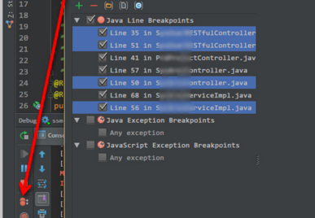   

## 概要   

* 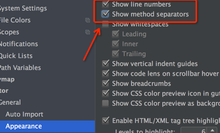   

# 全局设置   

* 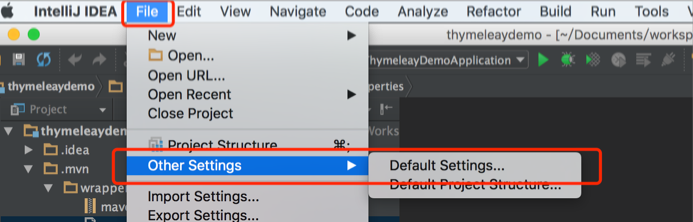   

# 乱码   

## 同一编码   

* 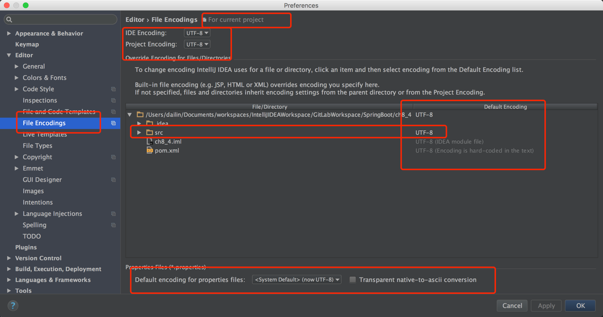   

* 一般IDE Encoding 不用修改   

## clean   

* mvn clean compile   

## 如果还不行，则项目pom里面设置一些源码的编码   

* <project.build.sourceEncoding>UTF-8</project.build.sourceEncoding><project.build.resourceEncoding>UTF-8</project.build.resourceEncoding><plugin>	<groupId>org.apache.maven.plugins</groupId>	<artifactId>maven-resources-plugin</artifactId>	<version>2.4.3</version>	<configuration>		<encoding>${project.build.resourceEncoding}</encoding>	</configuration></plugin>   
